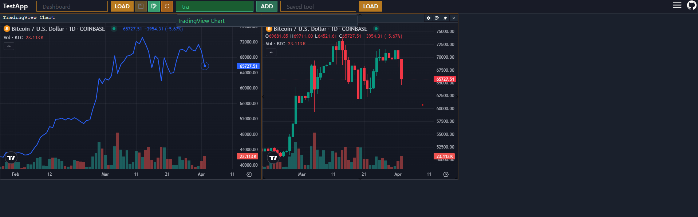

# FastBoard

A Lightweight app boilerplate to build widget-orientated interfaces

>TradingView widget example

This interface is for building dashboards quickly by creating mini-apps (react components) that are encapsulated as widgets in a homogenous interface. Widgets can talk to each other using various state hooks (recoil) and standardised configuration to allow for rapid development.

This project was inspired by common data serving applications that have the ability to metamorphose into different dashboards depending on the command sent to the application.

TBD...