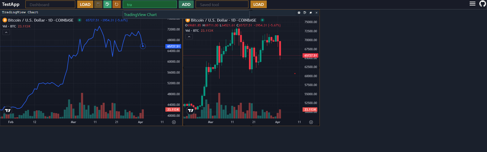

# FastBoard

A Lightweight app boilerplate to build widget-orientated interfaces

>TradingView widget example


This interface is for building dashboards quickly by creating mini-apps (react components) that are encapsulated as widgets in a homogenous interface. Widgets can talk to each other using a small set of state hooks (zustand) and standardised configuration to allow for rapid development.

This project was inspired by common data serving applications that have the ability to metamorphose into different dashboards depending on the command sent to the application.

## Query engines

Table widgets and the code editor can run on either of two in-browser engines, picked per table:

- **DuckDB** (duckdb-wasm): SQL. Uploads CSV, JSON and Parquet.
- **qpl** (the [qpl](../qpl) interpreter compiled to wasm): the `qpl` editor language. Uploads CSV and Parquet, which are decoded in JS (papaparse, hyparquet) and handed to qpl as Arrow. It runs in a Web Worker. The table widget's Filter is not available for qpl tables; filter with a qpl query in the editor instead.

### Setting up qpl

FastBoard links the wasm build from a sibling checkout of the qpl repo (`"qpl": "link:../qpl/tools/wasm/pkg"` in package.json), so before `yarn install` / `yarn dev`:

```bash
# next to this repo
git clone <qpl repo> ../qpl
make -C ../qpl wasm      # slow the first time: builds a patched Polars for wasm
```

Rebuilding the wasm is picked up without reinstalling. Tests that exercise the real interpreter (`src/data/qpl/wasm.test.ts`) skip themselves when the package isn't built.

## Adding a widget

A widget is three things: a **config** (what it is), a **component** (what it renders), and a **registry entry** (so the Add tool menu can find it). Everything below is compiled against the real types; the example is a counter, plus a second widget that reads it.

### 1. Declare it: `src/widgets/counter/config.ts`

```ts
import type { BaseWidgetDict } from '../../interfaces';
import { DefaultLayout } from '../../layout';

export const CounterWidgetConfig: BaseWidgetDict = {
    type: 'counter',                       // unique id; also the key in the component mapping
    disabled: false,
    name: 'Counter',                       // shown in the Add tool menu
    description: 'Counts clicks. Other widgets can read its value.',
    maxNo: 5,                              // max instances per board
    defaultLayout: { ...DefaultLayout, initialWidth: 300, initialHeight: 200 },
    settings: [
        { label: 'Step', settingsKey: 'step', type: 'number', default: 1, min: 1, max: 100 },
    ],
};
```

Keep the config file free of heavy imports: the registry imports it statically so the menu can list every widget without loading any widget code.

### 2. Build it: `src/widgets/counter/CounterWidget.tsx`

Default-export a `React.FC` whose props extend `WidgetElementProps` (`wKey`, `isStatic`, `containerRef`, `settingsIsOpen`). The values of your declared settings arrive as extra props.

```tsx
import React from 'react';
import { Center, Text, VStack } from '@chakra-ui/react';
import useAppColors from '../../hooks/useAppColors';
import FBButton from '../../components/primitive/Button';
import { stopPropagation } from '../../components/common';
import type { WidgetElementProps } from '../../interfaces';
import { useWidgetState, usePublishExports } from '../../store/hooks';

interface CounterProps extends WidgetElementProps {
    step?: number;                         // from the 'step' setting
}
interface CounterState {                   // private, saved with the board
    count?: number;
}
export interface CounterExports {          // public surface, not saved
    count: number;
    reset: () => void;
}

const CounterWidget: React.FC<CounterProps> = ({ wKey, isStatic, step = 1 }) => {
    const [colors] = useAppColors();
    const [state, setState] = useWidgetState<CounterState>(wKey);
    const count = state.count ?? 0;

    usePublishExports<CounterExports>(wKey, { count, reset: () => setState({ count: 0 }) }, [count]);

    return (
        <Center h="100%" onMouseDown={stopPropagation} onTouchStart={stopPropagation}>
            <VStack>
                <Text fontSize="4xl" color={colors.fore}>{count}</Text>
                <FBButton typ="info" isDisabled={isStatic} onClick={() => setState({ count: count + Number(step) })}>
                    Add {step}
                </FBButton>
            </VStack>
        </Center>
    );
};

export default CounterWidget;
```

### 3. Register it: `src/widgets/registry.ts`

```ts
import { CounterWidgetConfig } from './counter/config';

const CounterWidget = React.lazy(() => import('./counter/CounterWidget')); // lazy if it is heavy

export const widgetComponentMapping: WidgetComponentMapping = {
  // ...existing widgets
  counter: CounterWidget,                  // key must equal the config's `type`
};

export const widgetConfig: WidgetConfig = [
  // ...existing widgets
  CounterWidgetConfig,
];
```

Optionally add `counter: 'counter'` to `WIDGET_TYPE` in `src/widgets/types.ts` if other widgets will look it up by type. That is the whole job: the widget now appears in **Add tool**, can be dragged, docked, floated, renamed, locked, saved in boards and saved as a reusable tool.

### Settings: declarative or in the widget

- **Declarative** (`settings: [...]` above): rendered for you in a modal opened from the tab's right-click **Settings**. Supported `type`s are `input`, `number`, `select`, `switch`, `multiSelect`, `slider`, `textarea` and `date`. Use this for a few static options.
- **In the widget**: for controls that are live or change often, put a toolbar at the top of the widget and keep the values with `useWidgetState` (see the code editor, 3D graph and Reddit widgets). Set `settings: []` and the Settings entry disappears from the right-click menu.

## Framework hooks

All in `src/store/hooks.ts` unless noted. Each widget instance is identified by its `wKey` (a prop on every widget).

| Hook | Use it to |
|---|---|
| `useWidgetState<T>(wKey)` | Read and patch this widget's **private, persisted** state: `const [state, setState] = useWidgetState<T>(wKey)`. `setState` merges a partial patch. Saved with the board. |
| `usePublishExports(wKey, exports, deps)` | **Publish** a public surface (values and functions) for other widgets. Re-published when `deps` change and removed on unmount. Never persisted. |
| `useWidgetExports<T>(wKey)` | **Read** another widget's published surface, live. Returns `undefined` before it publishes and after it is closed. |
| `useWidgetsByType(type)` | List every widget of a type, e.g. all tables. The array is stable across unrelated renders, so it is safe in dependency arrays. |
| `useWidget(wKey)` / `useAllWidgets()` | Look up one widget's record (`wKey`, `type`, `name`, `settings`), or all of them. |
| `useAppColors()` (`hooks/useAppColors`) | Theme tokens (`bg`, `fore`, `info`, `success`, `warning`, `fail`, `surface`, `border`, ... each with `Half`/`Quarter`/`Barely` variants). Never hard-code colors. |
| `useUserAlert()` (`hooks/useUserAlert`) | Toasts: `const alert = useUserAlert(); alert('Saved', 'success', 'optional detail')`. Statuses: `success`, `fail`, `warning`, `info`. |
| `useKvStore(name)` (`hooks/useKvStore`) | Small localStorage key-value store: `get`, `set`, `list`. For app-level data; use `useWidgetState` for per-widget data. |

### Linking widgets

Widgets find each other by type and talk through published exports. This widget lets you pick any counter on the board and shows its value:

```tsx
import { useWidgetsByType, useWidgetExports, useWidgetState } from '../../store/hooks';
import type { CounterExports } from '../counter/CounterWidget';

const MirrorWidget: React.FC<WidgetElementProps> = ({ wKey }) => {
    const counters = useWidgetsByType('counter');                          // discover
    const [{ target }, setState] = useWidgetState<{ target?: string }>(wKey); // remember the choice
    const counter = useWidgetExports<CounterExports>(target);              // read live

    return (
        <VStack p={3} align="start" onMouseDown={stopPropagation} onTouchStart={stopPropagation}>
            <Select
                placeholder="Pick a counter"
                value={target ?? ''}
                onChange={(e) => setState({ target: e.target.value || undefined })}
            >
                {counters.map((c) => <option key={c.wKey} value={c.wKey}>{c.name}</option>)}
            </Select>
            {!target ? null : counter ? <Text>Count is {counter.count}</Text> : <Text>That counter was closed.</Text>}
        </VStack>
    );
};
```

Because only `target` (a string) is stored in state, the link survives a board save and reload; the live `counter` object is re-read from whatever publishes it. Always handle the `undefined` case: the widget you linked to may have been closed. Shared export shapes for the built-in widgets (table, editor, graph) live in `src/widgets/types.ts` so widgets can agree on them without importing each other.

### Rules of the road

- Wire `onMouseDown={stopPropagation}` and `onTouchStart={stopPropagation}` on interactive surfaces, or the dock treats clicks as drags.
- Respect `isStatic` (the group is locked): disable edit controls.
- Widgets are laid out by a dock panel of unknown size: give the root `h="100%"`, and measure with `containerRef` / a `ResizeObserver` if a library does not auto-size.
- Lazy-load anything heavy (`React.lazy` in the registry); every widget already renders inside a Suspense boundary and an error boundary.
- Anything a widget needs restored from a saved board belongs in `useWidgetState`, not `useState`.

## Feeding the catalog graph from a real data source

The 3D Catalog Graph is written against a small interface, `CatalogSource` (`src/widgets/graph/catalog.ts`), so it is not tied to DuckDB. Today only `DuckDbCatalogSource` ships; there is no HTTP client yet, and `GraphWidget` constructs the DuckDB one directly. To show a warehouse's catalog (Snowflake, Postgres, ClickHouse, a metadata service...) you need two things: an endpoint that returns the catalog as a graph, and a `CatalogSource` that calls it. This section is the contract for the first, and follows the same host-endpoint convention as remote storage and `/app/table/dataSources`: paths hang off the **Base path** in Settings (default `/app`).

The graph is **metadata only** (names, types, sizes). Querying the tables themselves is a separate contract: a `DataSource` (`src/data/types.ts`), described to the app by `GET /app/table/dataSources`.

### Endpoints

| Request | Response | |
|---|---|---|
| `GET {base}/catalog/graph` | `CatalogGraph` (below) | Required. The initial graph. |
| `GET {base}/catalog/expand?node=<id>` | `CatalogGraph` fragment | Optional. Returned nodes and links are **merged by id** into what is on screen. |

Both return `200` with `Content-Type: application/json`. Any other status is shown in the widget as "Could not read the catalog" with the status text and a Retry button, so use `401`/`403`/`5xx` honestly rather than returning an empty graph.

### Response shape

```jsonc
{
  "nodes": [
    { "id": "db:analytics", "label": "analytics", "kind": "database" },
    { "id": "sch:analytics.sales", "label": "sales", "kind": "schema",
      "meta": { "database": "analytics" } },
    { "id": "tbl:analytics.sales.orders", "label": "orders", "kind": "table",
      "meta": { "columns": 3, "estimatedRows": 1200000 } },
    { "id": "col:analytics.sales.orders.amount", "label": "amount", "kind": "column",
      "meta": { "type": "DECIMAL(18,2)", "nullable": false } }
  ],
  "links": [
    { "source": "db:analytics", "target": "sch:analytics.sales", "relation": "contains" },
    { "source": "sch:analytics.sales", "target": "tbl:analytics.sales.orders", "relation": "contains" },
    { "source": "tbl:analytics.sales.orders", "target": "col:analytics.sales.orders.amount", "relation": "contains" }
  ]
}
```

Rules the widget relies on:

- **`id`** is a unique, stable string per node (the same object must get the same id on every call, or `expand` merges will duplicate it). Do not build it by joining names with `.` if names can contain dots; encode the path (e.g. JSON) instead.
- **Direction is parent → child.** `source` is the container and `target` the thing it contains. The depth selector works by walking down from the nodes that nothing links *to* (the roots), so a reversed link puts columns above their tables. Every `source`/`target` must be a node id in the same response (or already on screen, for `expand`); dangling links are dropped.
- **`kind`** is a free string. `database`, `schema`, `table` and `column` get their own colours; anything else is drawn in a fallback colour and still works.
- **`meta`** is shown in the detail panel as `key: String(value)`, so keep values flat (strings, numbers, booleans). Nested objects render as `[object Object]`.
- **Column `meta.type`** drives the colour-by-type: send the type name as text. The widget recognises DuckDB/SQL-style names by prefix: `VARCHAR`/`TEXT`/`STRING`/`UUID`, `INT*`/`BIGINT`/`DECIMAL`/`DOUBLE`/`FLOAT`/`NUMERIC`, `BOOL*`, `DATE`/`TIME*`/`TIMESTAMP*`/`INTERVAL`, and `STRUCT`/`LIST`/`MAP`/`ARRAY`/`T[]`. Anything else (for example Snowflake's `NUMBER(10,2)`) is drawn grey, so normalise vendor types to the closest of these on the server.
- **Other relations are allowed.** A foreign key can be a `{ "relation": "references" }` link between two table nodes; it is drawn as a plain link with the relation shown on hover, and is not styled specially yet.

### Size and lazy loading

The widget asks before drawing more than **5,000** nodes, and only labels what stays readable, but a 3D force layout still gets slow well before that. For a large catalog, do the trimming on the server:

- Return databases, schemas and tables from `/catalog/graph`, and columns from `/catalog/expand?node=<table id>`. Double-clicking a node calls `expand` and merges the result.
- Never return columns for tables the user cannot see: the endpoint, not the browser, is the permission boundary. Filter by the caller's identity, and keep secrets and internal identifiers out of `meta`, since it is displayed verbatim.

### Auth and CORS

The browser calls the endpoint directly, so it must be same-origin or send CORS headers (including for `Authorization`, if you use it). Nothing credential-related is stored in the bundle: use a session cookie or a token your host page already holds.

### Plugging it in

```ts
import type { CatalogGraph, CatalogSource } from './widgets/graph/catalog';
import { useAppSettings } from './store/appSettings';

export class HttpCatalogSource implements CatalogSource {
  readonly id = 'http';
  readonly label = 'Data catalog';
  private url = (path: string) =>
    `${useAppSettings.getState().remoteBaseUrl.replace(/\/$/, '')}/catalog/${path}`;

  async getGraph(): Promise<CatalogGraph> {
    const res = await fetch(this.url('graph'), { headers: { Accept: 'application/json' } });
    if (!res.ok) throw new Error(`${res.status} ${res.statusText}`);
    return res.json();
  }
  // omit `expand` if the whole graph comes from getGraph
  async expand(nodeId: string): Promise<CatalogGraph> {
    const res = await fetch(this.url(`expand?node=${encodeURIComponent(nodeId)}`), { headers: { Accept: 'application/json' } });
    if (!res.ok) throw new Error(`${res.status} ${res.statusText}`);
    return res.json();
  }
}
```

Then swap it in where `GraphWidget.tsx` creates its source (`new DuckDbCatalogSource()`), or add a source picker there if the widget should offer both. Note the widget reloads when a table widget binds a table, which is a DuckDB-only trigger; for a remote catalog the Refresh button is what re-fetches.

## Reddit widget and `server/`

The Reddit Feed widget follows a subreddit (or a search) over SSE. Reddit has no push API, so `server/` is a small Rust ([Axum](https://github.com/tokio-rs/axum)) backend that does the polling. It is a port of the `RedditWrapper` and SSE router from [e3-utils](https://github.com/nicelgueta/e3-utils):

- `GET /sse/redditSearch?search_term=..&subreddit=..&period=..&limit=..&sort=..` polls Reddit's `search.json` every 2s (or `/r/<sub>/new.json` when there's no search term) and sends the listing whenever its newest post changes. A failed poll is sent as a `stream-error` event.
- Everything else serves the built app from `dist/` (`/board` and other client routes get `index.html`).

```bash
yarn build
cd server && cargo run --release             # http://127.0.0.1:8080; PORT and FASTBOARD_DIST override
```

For `yarn dev`, run the server alongside it: Vite proxies `/sse` to port 8080. Building needs a Rust toolchain (via [rustup](https://rustup.rs/)).

Reddit answers many unauthenticated `.json` requests with 403 (the widget then shows "Reddit responded 403"). To get past it, give the server Reddit OAuth credentials:

1. Create an app at https://www.reddit.com/prefs/apps: type **script**, any name, redirect URI `http://localhost`. The client id is the string under the app name; the secret is labelled "secret".
2. Put them in a `.env` file in the repo root (gitignored, no quotes), or export them in your shell:

   ```
   REDDIT_CLIENT_ID=your_id
   REDDIT_CLIENT_SECRET=your_secret
   ```

3. `make run` (or `make dev`). The server logs `Reddit: OAuth` on start and polls `oauth.reddit.com` instead.
